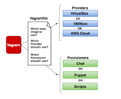

# Introduction

The **Vagrantfile** is a Ruby file used to configure **Vagrant** on a per project basis. The main function of the **Vagrantfile** is to described the virtual machines required for a project as well as how to configure and provision theses machines.



# Load Order

An important concept to understand is how Vagrant loads the Vagrantfile. Actually, there are a series of Vagrantfiles that Vagrant will load. Each subsequent Vagrant loaded will overriden any settings set previously. The Vagrantfiles that are loaded and the order they're loaded is shown below:

1. Vagrantfile from the gem directory is loaded. This contains all the defaults and should never be edited.
2. Vagrantfile from the box directory is loaded if a box is specified. This is the Vagrantfile that is packaged with the box if you use the ``--vagrantfile`` option when packaging.
3. Vagrantfile from the hole directory (defaults to ``~/.vagrant.d/``) is loaded if it exists. This Vagrantfile allows you to set some defaults that may be specific to your user.
4. Vagrantfile from the project directory is loaded. This is typically the file that users will be touching.

Therefore, the Vagrantfile in the project directory overwritten any conflicting configuration from the home directory which overwrites any conflicting configuration from a box which overwrites any conflicting configuration from the default file.

# Configuration options

There are many options available to configure Vagrant. The options include specifying the box to use, shared folders, networking configuration etc.

The most important configuration options are listed below:

- ``config.vm.box``
- ``config.vm.box_url``
- ``config.vm.customize``
- ``config.vm.define``
- ``config.vm.forward_port``
- ``config.vm.guest``
- ``config.vm.hostname``
- ``config.vm.network``
- ``config.vm.provision``
- ``config.vm.share_folder``
- ``config.ssh.host``
- ``config.ssh.port``
- ``config.ssh.username``
- ``config.ssh.forward_x11``
- ``config.ssh.shell``
- ``config.ssh.max_retries``
- ``config.ssh.timeout``
- ``config.package.name``
- ``config.vagrant.host``
- ``config.vagrant.dotfile_name``

# An improved way to use YAML rather than Ruby

This technique is by no means something that I invented or created, so I can’t take any credit whatsoever, this is an idea I first saw [here](https://bertvv.github.io/notes-to-self/2015/10/05/one-vagrantfile-to-rule-them-all/). The main concept is to abstract the Ruby configuration options from the Vagrantfile in order to have an more *user-friendly* way for people without any ruby skills to read and configure the Vagrantfile through an [YAML](https://docs.ansible.com/ansible/latest/reference_appendices/YAMLSyntax.html) configuration file.

The ``vagrant.yaml`` configuration file abstracts many of the basic Vagrantfile configuration options such as: *config.vm.box*, *config.vm.network*, *config.vm.provider*, *config.vm.share_folder*. Moreover, the ``vagrant.yaml`` exposes configuration options of some of the most popular [vagrant plugins](plugins.md), letting the user of the vagrant box to specify the desired state of the vagrant box only through the modification of this single centralized configuration file.

The *magic,* so to speak, comes from these *two lines* in the Vagrantfile:

```ruby
PROJECT_PATH = File.dirname(File.expand_path(__FILE__))
VCONFIG = Utils.load_config(File.join(PROJECT_PATH, 'vagrant.yaml'))
```

where vagrant loads the environment configuration from the external ``vagrant.yaml`` and sets the low level Vagrantfile ruby configuration options with the appropriate values.

```ruby
HOST = VCONFIG[:host]
SSH = VCONFIG[:ssh]

Vagrant.configure('2') do |config|

    #-- Vagrant SSH settings --#
    Ssh.configure(config, SSH)

    #-- VM Settings --#
    config.vm.define HOST[:name] do |node|

        #-- Box Settings --#
        node.vm.box = HOST[:box]
        node.vm.box_url = HOST[:box_url]
        node.vm.box_check_update = HOST[:box_update]
        node.vm.hostname = HOST[:name]
        node.vm.boot_timeout = HOST[:boot_timeout]

        #-- Provider Settings --#
        node.vm.provider "virtualbox" do |vb|
            vb.gui = HOST[:gui]
            vb.name= HOST[:name]
            VirtualBox.resources(vb, HOST)
            VirtualBox.modify_vm(vb, HOST)
            VirtualBox.guest_property(vb, HOST)
    end
```

!!! attention "Don't change the Vagrantfile"
    Be careful when changing the Vagrantfile. A small mistake and the environment is unusable. In most cases, there is no need to change the Vagrantfile. Instead, update the ``vagrant.yaml``.
